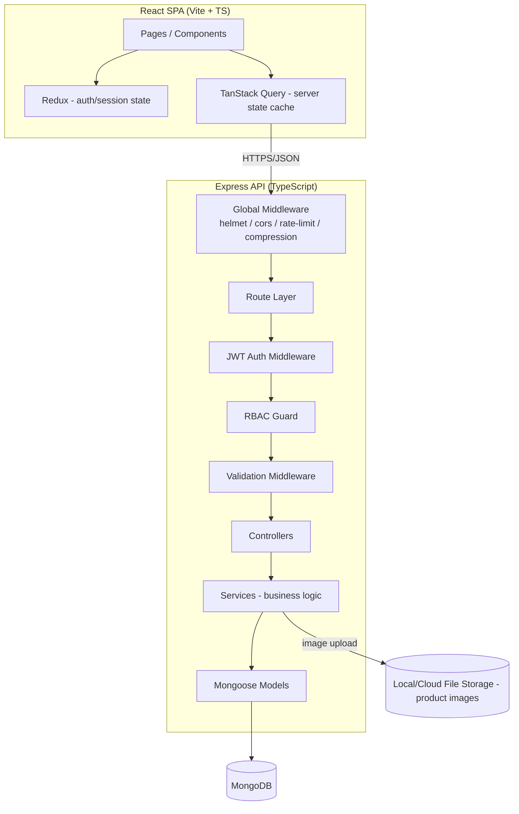
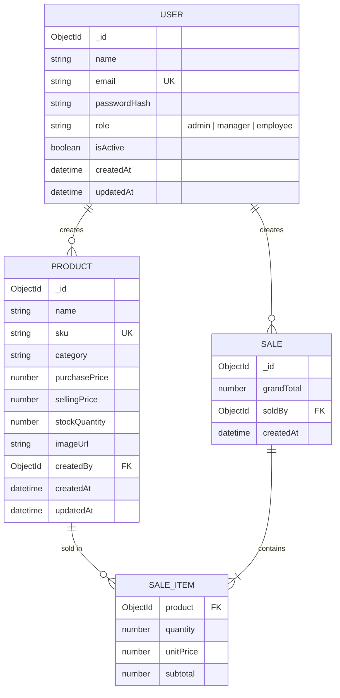
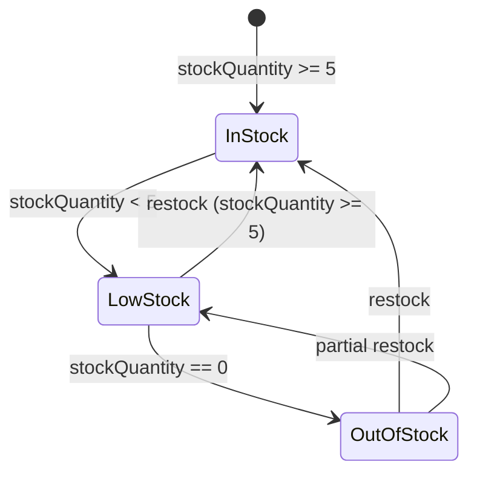
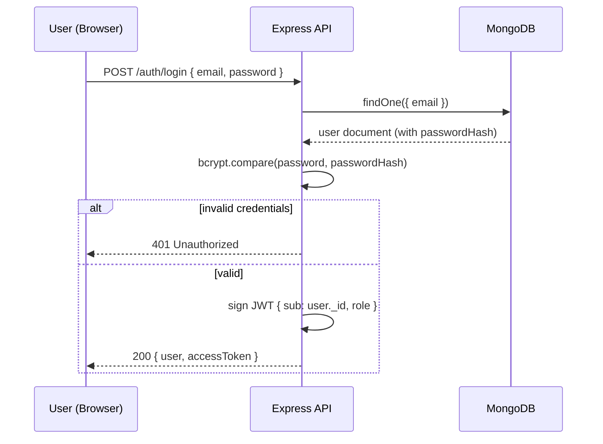
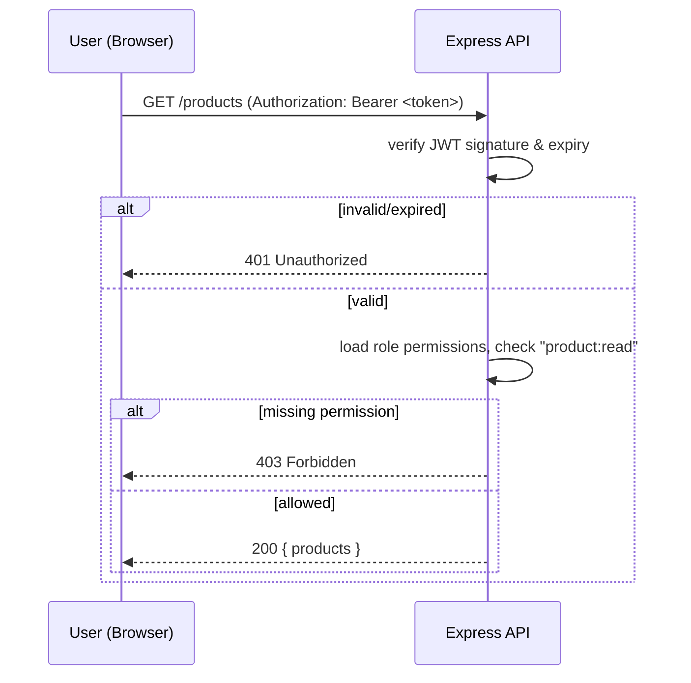
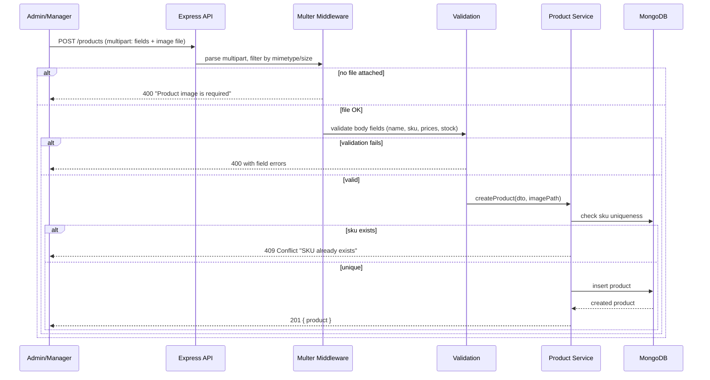
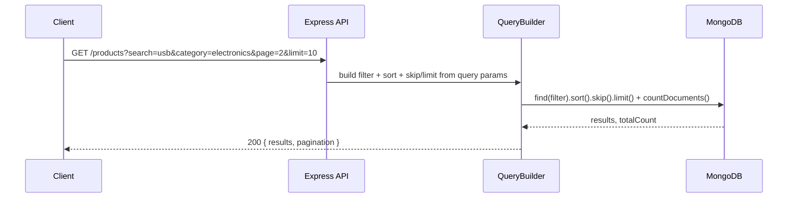
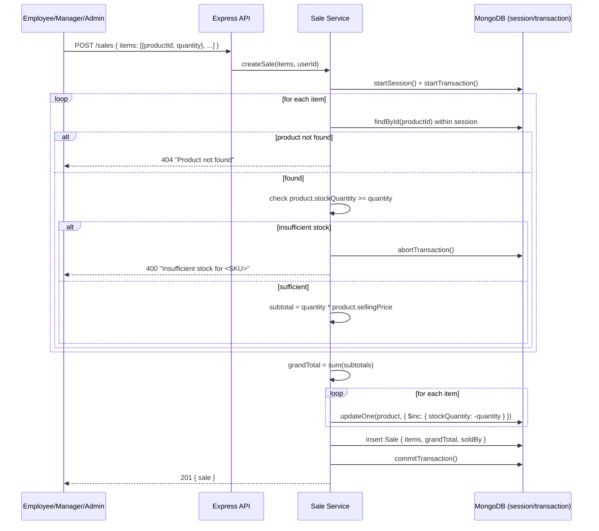
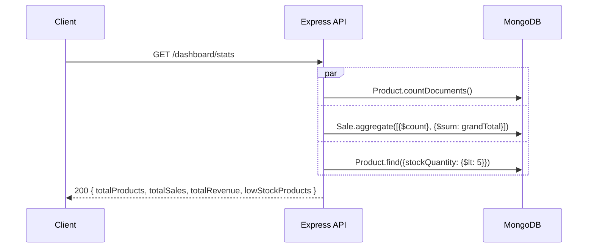

# MINI ERP – Inventory & Sales Management System
## Master Architecture Document

---

## Table of Contents

1. [Project Overview](#1-project-overview)
2. [System Architecture (HLD)](#2-system-architecture-hld)
3. [Tech Stack](#3-tech-stack)
4. [Folder Structure](#4-folder-structure)
5. [Environment Config (.env)](#5-environment-config-env)
6. [Database Schema (ERD)](#6-database-schema-erd)
7. [Indexing Strategy](#7-indexing-strategy)
8. [State & Stock Transitions](#8-state--stock-transitions)
9. [Role & Permission Matrix](#9-role--permission-matrix)
10. [API Endpoints — Full Reference](#10-api-endpoints--full-reference)
11. [API Response Format & Conventions](#11-api-response-format--conventions)
12. [Authentication Flow (Sequence Diagrams)](#12-authentication-flow-sequence-diagrams)
13. [Product Module (Sequence Diagrams)](#13-product-module-sequence-diagrams)
14. [Sales Module (Sequence Diagrams)](#14-sales-module-sequence-diagrams)
15. [Dashboard Module (Aggregation Flow)](#15-dashboard-module-aggregation-flow)
16. [Generic Query Builder (Search/Filter/Sort/Pagination)](#16-generic-query-builder-searchfiltersortpagination)
17. [Frontend Architecture](#17-frontend-architecture)
18. [Error Handling & Edge Cases](#18-error-handling--edge-cases)
19. [Security Considerations](#19-security-considerations)
20. [Testing Strategy](#20-testing-strategy)
21. [Deployment & DevOps](#21-deployment--devops)
22. [Development Roadmap](#22-development-roadmap)
23. [Template Reuse Matrix — What Comes From the Old Repo vs What's Built From Scratch](#23-template-reuse-matrix--what-comes-from-the-old-repo-vs-whats-built-from-scratch)

---

## 1. Project Overview

**Mini ERP** is a role-based Inventory & Sales Management System. Three roles — **Admin, Manager, Employee** — share one system with different permissions. The core workflows are:

- Manage a product catalog (with images, SKUs, pricing, stock).
- Record sales against that catalog, with the system enforcing stock availability and computing totals automatically.
- Give management a live dashboard of inventory health and sales activity.

This is a full-stack project: a TypeScript/Express/MongoDB backend and a TypeScript/React frontend, built as two coordinated codebases in Two repository

Unlike a large, multi-domain platform (auth providers, chat, billing, notifications), this system has a **small, well-defined domain** (3 modules + auth). The architecture below is deliberately sized to that scope — it is thorough where the domain has real complexity (stock-safe sale creation, RBAC) and intentionally simple where it doesn't (no OAuth, no billing, no websockets, since none are required).

---

## 2. System Architecture (HLD)



**Architectural style:** Modular Monolith. One deployable Express service, internally split into independent feature modules (`auth`, `product`, `sale`, `dashboard`), each with its own routes/controller/service/model/validation. This is simple to deploy and reason about, while still being organized enough to extend later (e.g., splitting `product` into its own microservice would require touching only that folder).

**Request flow (every protected request passes through all of these, in order):**
`Route → JWT Auth → RBAC Permission Check → Request Validation → Controller (HTTP only) → Service (business logic) → Model (data access) → MongoDB`

A controller never calls Mongoose directly, and a service never touches `req`/`res` — this is what makes the stock-deduction logic in the Sale service unit-testable in isolation.

---

## 3. Tech Stack

| Layer | Technology |
|---|---|
| Backend runtime | Node.js (LTS) |
| Backend framework | Express.js |
| Language | TypeScript (both backend & frontend) |
| Database | MongoDB |
| ODM | Mongoose |
| Auth | JWT (access token), bcrypt for password hashing |
| Validation | Zod (or Joi) |
| File upload | Multer (disk storage for dev; swappable for S3/Cloudinary later) |
| Frontend framework | React + Vite |
| Routing | React Router |
| Styling | Tailwind CSS + shadcn/ui |
| State management | Redux Toolkit (auth/session) + TanStack Query (server state, caching, mutations) |
| API docs | Swagger (swagger-jsdoc + swagger-ui-express) |
| Logging | Winston + Morgan |
| Process management | PM2 (`ecosystem.config.json`) |

---

## 4. Folder Structure

### 4.1 Repository layout
```
mini-erp/
├── backend/
mini-erp/
└── frontend/
```

### 4.2 Backend (`backend/src`)
```
src/
├── config/
│   ├── env.ts                # typed, validated env vars
│   ├── db.ts                 # mongoose connection
│   ├── logger.ts
│   └── roles.ts               # role → permission matrix
├── modules/
│   ├── auth/
│   │   ├── auth.routes.ts
│   │   ├── auth.controller.ts
│   │   ├── auth.service.ts
│   │   └── auth.validation.ts
│   ├── user/
│   │   ├── user.model.ts
│   │   ├── user.service.ts
│   │   └── ... (admin-only user management, optional)
│   ├── product/
│   │   ├── product.model.ts
│   │   ├── product.routes.ts
│   │   ├── product.controller.ts
│   │   ├── product.service.ts
│   │   └── product.validation.ts
│   ├── sale/
│   │   ├── sale.model.ts
│   │   ├── sale.routes.ts
│   │   ├── sale.controller.ts
│   │   ├── sale.service.ts
│   │   └── sale.validation.ts
│   └── dashboard/
│       ├── dashboard.routes.ts
│       ├── dashboard.controller.ts
│       └── dashboard.service.ts
├── middlewares/
│   ├── auth.middleware.ts        # verifies JWT
│   ├── rbac.middleware.ts        # requirePermission("product:create")
│   ├── validate.middleware.ts
│   ├── upload.middleware.ts
│   └── error.middleware.ts
├── common/
│   ├── ApiError.ts
│   ├── ApiResponse.ts
│   ├── catchAsync.ts
│   └── QueryBuilder.ts
├── routes/
│   └── index.ts                  # mounts /api/v1/*
├── app.ts
└── server.ts
```

### 4.3 Frontend (`frontend/src`)
```
src/
├── api/
│   ├── axiosInstance.ts          # base axios + interceptor (attach token, handle 401)
│   ├── auth.api.ts
│   ├── product.api.ts
│   ├── sale.api.ts
│   └── dashboard.api.ts
├── app/
│   └── store.ts                  # Redux store (auth slice only)
├── features/
│   ├── auth/
│   │   ├── authSlice.ts
│   │   ├── LoginPage.tsx
│   │   └── ProtectedRoute.tsx
│   ├── dashboard/
│   │   ├── DashboardPage.tsx
│   │   ├── StatCard.tsx
│   │   └── LowStockTable.tsx
│   ├── products/
│   │   ├── ProductListPage.tsx
│   │   ├── ProductForm.tsx        # shared for Add/Edit
│   │   ├── ProductTable.tsx
│   │   └── useProducts.ts         # TanStack Query hooks
│   └── sales/
│       ├── CreateSalePage.tsx
│       ├── ProductPicker.tsx
│       ├── SaleLineItems.tsx
│       └── useSales.ts
├── components/ui/                 # shadcn primitives
├── layouts/
│   └── DashboardLayout.tsx        # sidebar + topbar shell for authenticated pages
├── routes/
│   └── AppRoutes.tsx
└── main.tsx
```

---

## 5. Environment Config (.env)

```ini
# Server
NODE_ENV=development
PORT=5000

# Database
MONGO_URI=mongodb://localhost:27017/mini-erp

# Auth
JWT_SECRET=replace_with_strong_secret
JWT_ACCESS_EXPIRATION_MINUTES=60

# File Upload
UPLOAD_DIR=public/uploads/products
MAX_FILE_SIZE_MB=5

# CORS
CLIENT_URL=http://localhost:5173
```

Frontend `.env`:
```ini
VITE_API_BASE_URL=http://localhost:5000/api/v1
```

---

## 6. Database Schema (ERD)



`SALE_ITEM` is not a separate collection — it is an embedded subdocument array on `SALE` (`sale.items[]`), since line items have no independent lifecycle and are always read/written together with their parent sale. This keeps sale creation a single atomic document write plus the stock-decrement updates (wrapped in a transaction — see §14).

---

## 7. Indexing Strategy

| Collection | Index | Purpose |
|---|---|---|
| `users` | `{ email: 1 }` unique | Login lookup, uniqueness constraint |
| `products` | `{ sku: 1 }` unique | SKU uniqueness, fast lookup |
| `products` | `{ name: "text", category: "text" }` | Search endpoint |
| `products` | `{ category: 1 }` | Category filter |
| `products` | `{ stockQuantity: 1 }` | Fast "low stock" dashboard query |
| `sales` | `{ createdAt: -1 }` | Recent sales listing, dashboard "total sales" range queries |
| `sales` | `{ soldBy: 1 }` | Per-employee sales reporting (future) |

---

## 8. State & Stock Transitions

This project has no multi-step approval workflows (no listing-status or subscription-style state machine is needed for this domain). The one meaningful "state" is a **product's derived stock status**, computed on read rather than stored, to avoid a second source of truth:



`stockQuantity` only changes in two places: (1) admin/manager manually editing a product, (2) the Sale service decrementing it inside a transaction on sale creation. There is no separate "status" field to keep in sync — the dashboard's low-stock query (`stockQuantity < 5`) and the UI badge both derive from the same field.

---

## 9. Role & Permission Matrix

| Permission | Admin | Manager | Employee |
|---|:---:|:---:|:---:|
| `product:create` | ✅ | ✅ | ❌ |
| `product:read` | ✅ | ✅ | ✅ |
| `product:update` | ✅ | ✅ | ❌ |
| `product:delete` | ✅ | ❌ | ❌ |
| `sale:create` | ✅ | ✅ | ✅ |
| `sale:read` | ✅ | ✅ | ✅ |
| `dashboard:read` | ✅ | ✅ | ✅ |
| `user:manage` (future) | ✅ | ❌ | ❌ |

Implementation (`config/roles.ts`):
```ts
export const ROLE_PERMISSIONS = {
  admin:    ["product:create","product:read","product:update","product:delete",
             "sale:create","sale:read","dashboard:read","user:manage"],
  manager:  ["product:create","product:read","product:update",
             "sale:create","sale:read","dashboard:read"],
  employee: ["product:read","sale:create","sale:read","dashboard:read"],
} as const;
```
`rbac.middleware.ts` exposes `requirePermission("product:delete")`, chained after `auth.middleware.ts` on every protected route. Keeping this as a plain object (not a DB collection) matches the required scope; moving it into a `roles` collection with an admin CRUD UI is the natural "Dynamic Role & Permission Management" bonus upgrade, and the middleware is written so that swap doesn't change any route code.

---

## 10. API Endpoints — Full Reference

### Auth
| Method | Endpoint | Auth | Description |
|---|---|---|---|
| POST | `/api/v1/auth/login` | Public | Returns `{ user, accessToken }` |
| GET | `/api/v1/auth/me` | JWT | Current user profile |

### Products
| Method | Endpoint | Permission | Description |
|---|---|---|---|
| GET | `/api/v1/products` | `product:read` | List, supports `?search=&category=&page=&limit=&sortBy=` |
| GET | `/api/v1/products/:id` | `product:read` | Single product |
| POST | `/api/v1/products` | `product:create` | multipart/form-data, image required |
| PATCH | `/api/v1/products/:id` | `product:update` | Partial update, image optional |
| DELETE | `/api/v1/products/:id` | `product:delete` | Admin only |

### Sales
| Method | Endpoint | Permission | Description |
|---|---|---|---|
| POST | `/api/v1/sales` | `sale:create` | Body: `{ items: [{ productId, quantity }] }` |
| GET | `/api/v1/sales` | `sale:read` | List sale history, `?page=&limit=&from=&to=` |
| GET | `/api/v1/sales/:id` | `sale:read` | Single sale detail |

### Dashboard
| Method | Endpoint | Permission | Description |
|---|---|---|---|
| GET | `/api/v1/dashboard/stats` | `dashboard:read` | `{ totalProducts, totalSales, totalRevenue, lowStockProducts[] }` |

---

## 11. API Response Format & Conventions

**Success:**
```json
{
  "success": true,
  "statusCode": 200,
  "message": "Products fetched successfully",
  "data": {
    "results": [ /* ... */ ],
    "pagination": { "page": 1, "limit": 10, "totalPages": 4, "totalResults": 37 }
  }
}
```

**Error:**
```json
{
  "success": false,
  "statusCode": 400,
  "message": "Insufficient stock for SKU-1023",
  "errors": [ { "field": "items[0].quantity", "message": "Only 3 left in stock" } ]
}
```

Conventions:
- `2xx` only on success; `4xx` for client errors (validation, auth, not found, business-rule violations like insufficient stock); `5xx` reserved for unexpected server errors.
- Every list endpoint returns the same `{ results, pagination }` shape.
- No endpoint ever returns a bare array or bare object at the top level — always wrapped in the envelope above, so the frontend's axios interceptor can unwrap `response.data.data` uniformly.

---

## 12. Authentication Flow (Sequence Diagrams)

### 12.1 Login


### 12.2 Protected Route Access


---

## 13. Product Module (Sequence Diagrams)

### 13.1 Create Product (image required)


### 13.2 Search + Pagination


---

## 14. Sales Module (Sequence Diagrams)

### 14.1 Create Sale (stock-safe, transactional)


This is the one place in the system where a transaction is non-negotiable: stock decrement and sale-record creation must succeed or fail together, or the system can end up either overselling stock or recording a sale that never actually reduced inventory.

---

## 15. Dashboard Module (Aggregation Flow)



Implemented as three independent queries run in parallel (`Promise.all`), not sequential — no query depends on another's result.

---

## 16. Generic Query Builder (Search/Filter/Sort/Pagination)

A single reusable helper (`common/QueryBuilder.ts`) is shared by both `product.service.ts` and `sale.service.ts`, so pagination/search/sort logic is written once:

```ts
class QueryBuilder<T> {
  constructor(private query: mongoose.Query<T[], T>, private queryParams: Record<string, string>) {}
  search(fields: string[]) { /* builds $or regex/text filter from ?search= */ }
  filter(allowed: string[]) { /* whitelists filterable fields, e.g. ?category= */ }
  sort() { /* ?sortBy=field:asc|desc, default -createdAt */ }
  paginate() { /* ?page= & ?limit=, default page=1, limit=10 */ }
  async execute() { return Promise.all([this.query, this.countQuery]); }
}
```
Usage stays identical across modules: `new QueryBuilder(Product.find(), req.query).search(["name","sku"]).filter(["category"]).sort().paginate().execute()`.

---

## 17. Frontend Architecture

### 17.1 State management split
- **Redux (RTK)**: only `authSlice` — current user, role, token, `isAuthenticated`. Persisted to memory + a single rehydration read from storage on app load.
- **TanStack Query**: everything that comes from the API — products, sales, dashboard stats. Gives caching, background refetch, and automatic invalidation after mutations (e.g., creating a sale invalidates both the sales list and the dashboard stats query).

### 17.2 Routing & Protection
```mermaid
flowchart LR
    A[/login] -->|on success| B[/dashboard]
    B --> C[/products]
    B --> D[/sales/new]
    B --> E[/sales]
    subgraph ProtectedRoute
    B
    C
    D
    E
    end
    ProtectedRoute -->|no token / expired| A
    C -->|role check: create/edit/delete buttons hidden for Employee| C
```
`ProtectedRoute` checks `isAuthenticated` from the Redux auth slice; role-gated UI elements (e.g., "Delete Product" button) are hidden client-side based on role **in addition to** the backend enforcing it server-side — the frontend check is a UX convenience, never the security boundary.

### 17.3 Component responsibilities (Product page as reference)
- `ProductListPage` — owns query params (search/page/filter) in URL state, renders `ProductTable`.
- `ProductTable` — presentational, receives data + pagination controls.
- `ProductForm` — one shared form for Add and Edit, using the same Zod schema as the backend validation (kept in a shared `types/` package if using a monorepo tool, or duplicated with a comment pointing to the backend schema otherwise).

### 17.4 Create Sale UX flow
`ProductPicker` (searchable dropdown) → adds a line to `SaleLineItems` → quantity input per line recalculates `subtotal` and `grandTotal` client-side instantly for UX, but the **server always recomputes and is the source of truth** for the persisted total (see §14.1) — the client-side total is a preview only.

---

## 18. Error Handling & Edge Cases

| Case | Handling |
|---|---|
| Duplicate SKU on product create | `409 Conflict` before insert attempt |
| Product create without image | `400` at the upload-middleware layer, before validation even runs |
| Sale requests more stock than available | `400`, transaction aborted, no partial stock deduction |
| Sale references a deleted/nonexistent product | `404`, transaction aborted |
| Invalid/expired JWT | `401` |
| Valid JWT, wrong role/permission | `403` |
| Malformed ObjectId in `:id` param | `400` (caught by validation, not left to Mongoose's raw CastError) |
| Unknown route | `404` via catch-all handler |
| Unhandled exception anywhere in the stack | Global `error.middleware.ts` catches it, logs via Winston, returns generic `500` in production (never leaks stack trace to the client) |

---

## 19. Security Considerations

- Passwords hashed with `bcrypt` (never stored/logged in plaintext).
- JWT secret from env, never committed; access tokens short-lived.
- `helmet` for secure headers, `cors` restricted to `CLIENT_URL` in production.
- `express-rate-limit` on `/auth/login` to slow down brute-force attempts.
- `express-mongo-sanitize` to strip `$`/`.` operators from user input (NoSQL injection).
- File upload restricted by MIME type and size (`upload.middleware.ts`), stored outside of any executable path.
- All monetary calculations (subtotal, grandTotal) computed server-side only — client-submitted totals are never trusted or persisted.
- RBAC enforced server-side on every mutating route; frontend role checks are UX-only (§17.2).

---

## 20. Testing Strategy

Given the project scope, testing effort is concentrated where the business risk is highest:

- **Unit tests**: `sale.service.ts` stock-deduction logic (sufficient stock, insufficient stock, concurrent sale simulation, multi-item sales).
- **Integration tests**: auth flow (login success/failure), product CRUD with/without image, RBAC rejection cases (employee attempting `product:delete`).
- **Manual/Postman**: full collection covering every endpoint in §10, organized by module, used for both dev verification and as a demo artifact.

---

## 21. Deployment & DevOps

- **Backend**: PM2-managed Node process (`ecosystem.config.json`), reverse-proxied via Nginx if deployed on a VM; or containerized with Docker if the deployment target requires it.
- **Frontend**: static build (`vite build`) served via Nginx or any static host (Vercel/Netlify).
- **Database**: MongoDB Atlas for managed hosting, or self-hosted MongoDB in the same VM for a simple deployment.
- **File storage**: local disk under `public/uploads` for development; swap to S3/Cloudinary via a single storage-adapter interface if deployed where disk isn't persistent (e.g., most PaaS).

---

## 22. Development Roadmap

| Phase | Scope |
|---|---|
| 1 | Project scaffolding (backend TS config, frontend Vite+TS+Tailwind), env setup, DB connection |
| 2 | Auth module: User model, login, JWT middleware, RBAC middleware |
| 3 | Product module: model, CRUD, image upload, QueryBuilder (search/pagination) |
| 4 | Sale module: model, transactional create-sale logic, sale history listing |
| 5 | Dashboard module: aggregation endpoint |
| 6 | Frontend: auth pages + protected routing |
| 7 | Frontend: Product list/add/edit/delete UI |
| 8 | Frontend: Create Sale UI with live total |
| 9 | Frontend: Dashboard UI |
| 10 | Polish: error boundary states, loading states, Swagger docs, Postman collection, README |

---